# GitHub 仓库深度体检 Agent (Repo Health Agent)

输入一个 GitHub 仓库 URL，Agent 自动执行多维度深度体检，输出带证据的健康报告，并支持基于报告的多轮追问对话。

**一句话定位**：不是"查 GitHub 表面数据"的工具，而是 **clone 代码做真实静态分析**——代码质量、依赖漏洞、密钥泄露都真查，每条结论带文件行号证据，最后由 LLM 生成自然语言总评，并支持多轮追问。

**差异化定位**：现有开源工具（RepoHealth、RepocheckAI 等）只查 GitHub API 表面元数据。本项目把"真实代码分析"作为核心差异点，并用 LangGraph 做多 Agent 编排、用 LLM 做总评与追问，是一个能写进简历的 **Agent 工程样例**。

---

## 整体架构



---

## LangGraph 状态图拓扑



> 并行分支：`metadata` 与 `docs` 在解析后独立运行（均不依赖克隆）；`code` 与 `security` 在克隆后并行（共享克隆目录）。`findings` 用 `operator.add` 做 reducer 累积，保证多节点结果不被覆盖。

---

## 功能清单（全部完成）

- [x] D1: 元数据维度体检（活跃度 / 社区影响力），输出 Markdown 报告
- [x] D2: 文档完整性分析（README / LICENSE / CONTRIBUTING / SECURITY / CI）
- [x] D3: clone 代码 + 静态分析（ruff / radon / bandit，带文件行号证据）
- [x] D4: 依赖漏洞扫描（OSV API）+ 硬编码密钥检测 → 安全维度
- [x] D5: Streamlit 可交互前端（输入 URL → 实时体检 → 5 维度可视化 + 多轮追问）
- [x] D6/D7: LangGraph 多 Agent 编排（状态图，真实并行 + 条件路由 + 容错降级）
- [x] D8: 基于报告的多轮追问对话（LLM 意图识别 + 上下文追踪，聚焦对话能力）

---

## 快速开始

```bash
# 1. 进入项目（依赖已装在该项目 venv 中；若需重装：）
pip install -e ".[dev]"

# 2. 可选：配置 GitHub Token 提升限流（不填也能跑，60 次/小时）
#    环境变量 GITHUB_TOKEN，或在 Streamlit 侧栏填写
#    启用 LLM 总评/追问需配置 ZHIPU_API_KEY 或 DEEPSEEK_API_KEY（见下）

# 3. CLI 跑一个仓库的体检
python -m repo_agent "fastapi/fastapi"
# 或完整 URL
python -m repo_agent "https://github.com/langchain-ai/langgraph"
# 跳过深度分析（只用 API 数据，更快）
python -m repo_agent "psf/requests" --skip-deep
# 启用 LLM 总体诊断（智谱/DeepSeek）
python -m repo_agent "psf/requests" --use-llm
```

报告输出到 `reports/<owner>_<name>.md`。

### 可交互前端

```bash
streamlit run app.py
```

左侧输入 `owner/repo` 或完整 URL，点击「开始体检」即可看到总分 + 5 维度卡片（证据 + 建议）；体检完成后页面下方出现「💬 多轮追问」聊天框，可基于报告继续提问（支持上下文追踪）。

### 环境变量

| 变量 | 作用 | 必需 |
|------|------|------|
| `GITHUB_TOKEN` | 提升 GitHub API 限流（60→5000 次/小时） | 否 |
| `ZHIPU_API_KEY` | 启用 LLM 总评/追问（智谱，免费 `glm-4-flash`，**优先**） | 否（但开启 LLM 时需要） |
| `DEEPSEEK_API_KEY` | 智谱不可用时的备选 LLM | 否 |

> 设置后需**重启运行环境**（终端/WorkBuddy）才能让进程读到新变量。

---

## 运行测试

```bash
pytest          # 29 个测试全过，含 LLM 相关用例（mock 不消耗真实 token）
```

---

## 当前体检维度

| 维度 | 检查内容 | 工具/数据源 |
|------|----------|-------------|
| 活跃度 | 提交频率、最近推送、PR 时效 | GitHub API |
| 社区/影响力 | Stars、Forks、贡献者分布 | GitHub API |
| 文档完整性 | README 质量、LICENSE/CONTRIBUTING/SECURITY/CI | GitHub API |
| 代码质量 | lint、圈复杂度、安全写法 | ruff / radon / bandit（克隆后） |
| 安全 | 依赖已知 CVE、硬编码密钥、.env 提交 | OSV API + 正则扫描（克隆后） |

---

## 项目结构（每个文件职责）

```
src/repo_agent/
├── __main__.py          # CLI 入口：解析参数，调 Pipeline.run()
├── __init__.py          # 包标识
├── models.py            # 数据模型：RepoRef / RepoMetadata / MetadataFinding / HealthReport
├── agents/
│   ├── __init__.py      # LangGraph 编排核心：Pipeline(StateGraph) + LLM 总评 + 意图/路由
│   └── qa.py            # D8 多轮追问 Agent：RepoQA（意图识别 + 上下文追踪）
├── clients/
│   ├── github_client.py # GitHub REST API 封装（只读）+ URL 解析
│   └── cloner.py        # 仓库获取：tarball 优先，git clone 降级，用完清理
├── analyzers/
│   ├── metadata_analyzer.py # 活跃度 + 社区/影响力 评分
│   ├── docs_analyzer.py     # 文档完整性 评分（纯规则）
│   ├── code_analyzer.py     # 代码质量：ruff + radon + bandit
│   └── security_analyzer.py # 安全：依赖漏洞(OSV) + 硬编码密钥
├── reporters/
│   └── markdown_reporter.py # Markdown 报告渲染与落盘
└── tests/               # pytest 用例（core/docs/code/security/app/qa）
app.py                   # Streamlit 前端（report + 多轮追问 UI）
```

详见 **`我的学习.md`**（项目内同名文件）——这是一份面向"非作者也能讲清项目"的超详细讲解文档，含名词解释、每个函数说明、评审问答脚本与踩坑记录。

---

## 安全设计（评审加分点）

- 只读分析克隆的代码，**绝不执行**仓库内任何脚本（防供应链投毒）。
- 每次分析用独立临时目录，用完即清理（防止磁盘残留敏感代码）。
- 国内网络：优先 codeload tarball 下载，失败降级 git clone。
- 非 Python 仓库优雅降级（静态分析/依赖扫描跳过，并明确说明原因）。
- 密钥扫描只扫文本文件、跳过 `.git/node_modules` 等，限制单文件大小。

---

## 评审亮点（简历可写）

1. **真实 Agent 编排**：用 LangGraph 显式建模并行分支、条件路由、状态累积（reducer）、容错降级——不是"套壳 LLM"。
2. **差异化数据源**：clone 代码做真静态分析（ruff/radon/bandit/OSV），结论带文件行号证据，而非只查 API 元数据。
3. **LLM 工程克制**：只在流水线末端调一次 LLM 做总评、按需多轮追问；其余靠确定性的规则评分，可解释、可测试、零成本。
4. **NLU 能力落地**：D8 的追问 Agent 显式做意图识别（有限意图分类）+ 上下文追踪，直接对应你的 对话能力。
5. **工程鲁棒性**：tarball 降级、限流兼容、临时目录清理、调用失败降级——生产级细节。

---

## 路线图

| 阶段 | 内容 | 状态 |
|------|------|------|
| 基础 | 元数据 → 文档 → clone 静态分析 → 安全扫描 | ✅ 完成 |
| 编排 | LangGraph 多 Agent 状态图（并行+路由+容错） | ✅ 完成 |
| 智能 | LLM 总评 + 多轮追问对话（意图识别/上下文追踪） | ✅ 完成 |
| 文档 | README 架构图 + 评审话术 + 我的学习.md | ✅ 完成 |
